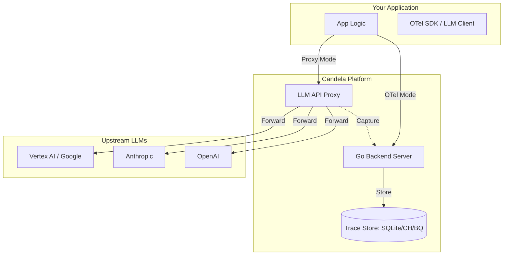

<div align="center">
  
  <h1>Candela</h1>
</div>
**Open-source, OTel-native LLM Observability & Engineering Platform.**

Candela is a production-grade observatory for your LLM applications. It captures every trace, calculates every cent, and evaluates every output with deep integration into **OpenTelemetry**, **Google Cloud (Vertex AI)**, and the wider GenAI ecosystem.

[](https://pkg.go.dev/github.com/candelahq/candela)
[](https://opensource.org/licenses/Apache-2.0)

---

## 🚀 Two Ways to Get Observability

Candela offers a dual-mode ingestion strategy to fit any stage of your project:

### 1. Zero-Code Proxy Mode (Quick Start)
Drop Candela into your existing app by just changing your `base_url`. No instrumentation needed.
- **OpenAI**: `http://localhost:8080/proxy/openai/v1`
- **Google Gemini**: `http://localhost:8080/proxy/google/`
- **Anthropic (via Vertex AI)**: `http://localhost:8080/proxy/anthropic/`

### 2. OTel-Native Agent Mode (Production)
For deep observability into agent frameworks (**ADK**, **LangChain**, **CrewAI**), Candela ingests standard OTLP spans through a custom-built **OTel Collector distro**.

---

## ✨ Key Features

- **🕯️ OTel-Native**: OTLP is our native language. No proprietary SDKs.
- **💰 Real-time Cost Tracking**: Automatic token extraction and USD calculation for OpenAI, Google, and Anthropic.
- **🧪 LLM-as-Judge (Phase 3)**: Automated quality scoring and evaluation rubrics.
- **🗄️ Pluggable Storage**: **SQLite** for instant local dev; **BigQuery** for serverless production scale.
- **📡 SSE Streaming Support**: Captures full streaming responses without interfering with user latency.
- **📦 Single-Binary Edge-Ready**: In-process queuing and processing for low-overhead deployments.

---

## 🚀 Quick Start

You can get Candela running in less than 60 seconds using either a local binary or Docker.

### Option A: Local Binary (Fastest)
Ideal for local development. Uses **SQLite** by default.

```bash
# Clone and enter the nix shell (or ensure Go 1.26 is installed)
nix develop

# Start the Candela server (defaults to SQLite + Port 8080)
go run ./cmd/candela-server
```

### Option B: Docker Compose (Full Stack)
Ideal for testing the full multi-service experience with **ClickHouse**.

```bash
# Start all services (server + collector + clickhouse)
docker compose -f deploy/docker-compose.yml up
```

---

## 🛠️ Route an LLM Call

Once Candela is running, point your favorite LLM client at the Candela proxy (Port 8080) to start capturing observability data instantly.

### OpenAI Example
```python
from openai import OpenAI

client = OpenAI(
    base_url="http://localhost:8080/proxy/openai/v1",
    api_key="sk-..."
)

# Call as usual — Candela handles the rest
response = client.chat.completions.create(...)
```

### Anthropic (via Vertex AI) Example
```python
from anthropic import Anthropic

client = Anthropic(
    base_url="http://localhost:8080/proxy/anthropic",
    api_key="YOUR_GCP_TOKEN" # Uses ADC for GCP authentication
)

response = client.messages.create(...)
```

---

## 🏗️ Architecture



---

## 🗺️ Roadmap

- **Phase 1: Foundation** ✅ (Ingestion, Proxy, Cost Calc, Docs)
- **Phase 2: Visual Explorer** 🔜 (Waterfall traces, Cost Dashboards)
- **Phase 3: Platform & Evaluation** 📋 (Admin Panel, Token Metering, LLM-as-Judge)
- **Phase 4: Ecosystem & Polish** 📋 (Agent DAGs, Multi-tenant, BigQuery backend)

---

## 📂 Project Structure

```
candela/
├── proto/           # Protobuf definitions (Source of Truth)
├── gen/             # Generated code (Go, TypeScript, Python)
├── cmd/             # Binary entry points (Server, CLI)
├── pkg/             # Core library logic (Proxy, Storage, Cost)
├── docs/            # Deep-dive documentation
├── collector/       # Custom OTel Collector distro
├── ui/              # Next.js web interface (Coming in Phase 2)
```
---

## 🤝 Contributing

We are in early development! See [CONTRIBUTING.md](./CONTRIBUTING.md) for local setup instructions and architectural deep dives.

## 📄 License

Apache License 2.0. See [LICENSE](./LICENSE) for details.
