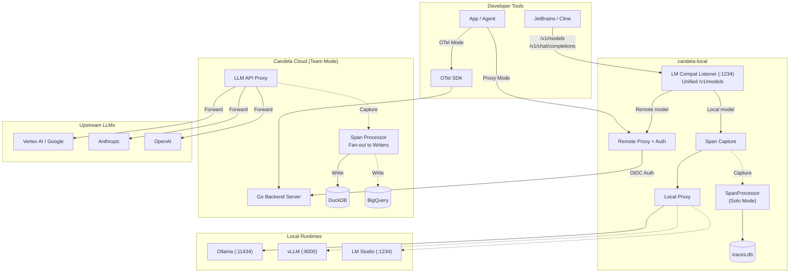

<div align="center">
  
  <h1>Candela</h1>
</div>
**Open-source, OTel-native LLM Observability & Engineering Platform.**

Candela is a production-grade observatory for your LLM applications. It captures every trace, calculates every cent, and evaluates every output with deep integration into **OpenTelemetry**, **Google Cloud (Vertex AI)**, and the wider GenAI ecosystem.

[](https://github.com/candelahq/candela/actions/workflows/ci.yml)
[](https://pkg.go.dev/github.com/candelahq/candela)
[](https://opensource.org/licenses/Apache-2.0)

---

## 🚀 Two Ways to Get Observability

Candela offers a dual-mode ingestion strategy to fit any stage of your project:

### 1. Zero-Code Proxy Mode (Quick Start)
Drop Candela into your existing app by just changing your `base_url`. No instrumentation needed.
- **OpenAI**: `http://localhost:8080/proxy/openai/v1`
- **Google Gemini**: `http://localhost:8080/proxy/google/`
- **Anthropic (via Vertex AI)**: `http://localhost:8080/proxy/anthropic/`

### 2. OTel-Native Agent Mode (Production)
For deep observability into agent frameworks (**ADK**, **LangChain**, **CrewAI**), Candela ingests standard OTLP spans through a custom-built **OTel Collector distro**.

---

## ✨ Key Features

- **🕯️ OTel-Native**: OTLP is our native language. No proprietary SDKs.
- **💰 Real-time Cost Tracking**: Automatic token extraction and USD calculation for OpenAI, Google, and Anthropic.
- **🔐 Role-Based Access Control**: Admin vs Developer roles with budget enforcement and grant-based spending.
- **🧪 LLM-as-Judge (Phase 3)**: Automated quality scoring and evaluation rubrics.
- **🗄️ Pluggable Storage**: **DuckDB** for high-performance local/edge; **BigQuery** for serverless production scale; **SQLite** for lightweight dev.
- **📡 SSE Streaming Support**: Captures full streaming responses without interfering with user latency.
- **📦 Single-Binary Edge-Ready**: In-process queuing and processing for low-overhead deployments.
- **🔀 Fan-out Architecture**: CQRS-based design allows writing to multiple sinks simultaneously (e.g., DuckDB + Pub/Sub).

---

## 🚀 Quick Start

You can get Candela running in less than 60 seconds using either a local binary or Docker.

### Option A: Local Binary (Fastest)
Ideal for local development. Uses **DuckDB** by default.

```bash
# Clone and enter the nix shell (or ensure Go 1.26 is installed)
nix develop

# Start the Candela server (defaults to DuckDB + Port 8080)
go run ./cmd/candela-server

# Start the UI (separate terminal)
cd ui && pnpm install && pnpm run dev
```

### Option B: Docker Compose (Full Stack)
Ideal for testing the full multi-service experience.

```bash
# Start all services (server + collector)
docker compose -f deploy/docker-compose.yml up
```

---

## 🛠️ Route an LLM Call

Once Candela is running, point your favorite LLM client at the Candela proxy (Port 8080) to start capturing observability data instantly.

### OpenAI Example
```python
from openai import OpenAI

client = OpenAI(
    base_url="http://localhost:8080/proxy/openai/v1",
    api_key="sk-..."
)

# Call as usual — Candela handles the rest
response = client.chat.completions.create(...)
```

### Anthropic (via Vertex AI) Example
```python
from anthropic import Anthropic

client = Anthropic(
    base_url="http://localhost:8080/proxy/anthropic",
    api_key="YOUR_GCP_TOKEN" # Uses ADC for GCP authentication
)

response = client.messages.create(...)
```

---

## 🏗️ Architecture



### Storage Architecture (CQRS)

Candela uses a **Command Query Responsibility Segregation** pattern:

| Interface | Purpose | Implementations |
|-----------|---------|-----------------|
| `SpanWriter` | Write-only ingestion | DuckDB, SQLite, BigQuery, Pub/Sub |
| `SpanReader` | Read-only queries | DuckDB, SQLite, BigQuery |
| `TraceStore` | Convenience (both) | DuckDB, SQLite, BigQuery |

The processor fans out writes to **all configured writers** concurrently. Only one reader is active (the primary backend).

---

## ⚙️ Configuration

Candela is configured via `config.yaml` (or `$CANDELA_CONFIG`):

```yaml
server:
  host: "0.0.0.0"
  port: 8080

storage:
  backend: "duckdb"  # duckdb | sqlite | bigquery
  duckdb:
    path: "candela.duckdb"
  sqlite:
    path: "candela.db"
  bigquery:
    project_id: "my-gcp-project"
    dataset: "candela"
    table: "spans"         # default: "spans"
    location: "US"         # default: "US"

cors:
  allowed_origins:
    - "http://localhost:3000"
    - "http://localhost:8080"

sinks:
  pubsub:
    enabled: false
    project_id: "my-gcp-project"
    topic: "candela-spans"

proxy:
  enabled: true
  project_id: "default"
  providers:
    - openai
    - google
    - anthropic

worker:
  batch_size: 100
  flush_interval: "2s"
```

---

## 🖥️ UI Development

The web interface is a Next.js 16 app in `ui/` with a dark-themed dashboard.

```bash
cd ui
pnpm install          # install deps (included in nix shell)
pnpm run dev           # start dev server → http://localhost:3000
pnpm run build         # production build (includes TypeScript type-check)
pnpm run test:e2e      # run Playwright E2E tests (27+ tests)
pnpm run test:e2e:ui   # Playwright interactive UI mode
```

The UI communicates with the backend via **ConnectRPC v2** on `localhost:8080`. Pages gracefully handle offline backend state.

> [!TIP]
> **Proto Generation**: We use **Buf Remote Generation**. Just run `buf generate` in the `proto/` directory—no local plugins required!

---

## 🕹️ candela-local — Local Development Proxy

`candela-local` is an auth-injecting proxy + runtime manager for developer machines.
It operates in two modes:

### 🏠 Solo Mode (Zero-Config)

Run local models with full observability — **no cloud account needed**.

```yaml
# ~/.candela.yaml
runtime_backend: ollama
```

```bash
candela-local   # starts on :8181 (proxy) + :1234 (LM compat)
```

- Local models via Ollama/vLLM on `:1234`
- Every call traced to `~/.candela/traces.db` (SQLite)
- Management UI at `http://localhost:8181/_local/`

### 🌐 Team Mode (Cloud + Local)

Connect to a shared Candela server for cloud models (GPT-4o, Claude, Gemini) alongside local ones.

```yaml
# ~/.candela.yaml
runtime_backend: ollama
remote: https://candela-xxx.a.run.app
audience: "12345678.apps.googleusercontent.com"
```

- Local + cloud models merged into `/v1/models`
- Smart routing: local models stay local, cloud models route through Candela server
- OIDC auth injected automatically via ADC

> [!TIP]
> A single developer can use Team Mode — just deploy a Candela server.
> See [docs/candela-local.md](docs/candela-local.md) for full setup guide.

### Unified Model Discovery

The LM-compatible listener on `:1234` merges **local** and **remote** models into a single `/v1/models` response:

```bash
# JetBrains, Cline, or any OpenAI-compatible client sees everything:
curl http://localhost:1234/v1/models
# → local: llama3.2:3b, mistral:7b (from Ollama)
# → remote: gpt-4o, claude-3.5-sonnet (from Cloud Run)  [Team Mode only]
```

`/v1/chat/completions` automatically routes to the right backend:
- **Local model** → Ollama/vLLM/LM Studio (no round-trip)
- **Remote model** → Cloud Run proxy (with OIDC auth injection)

### Runtime Management UI

Embedded management UI at `/_local/` for controlling local LLM runtimes:

- **Runtime control** — Start/stop Ollama, vLLM, or LM Studio; health monitoring with auto-polling
- **Model management** — List, load, unload, and **delete** models from disk
- **Pull models** — Download models with real-time progress tracking and **cancel** support
- **Traces** — Recent LLM calls with tokens, cost, duration (Solo Mode)
- **Backend discovery** — Auto-detect installed runtimes and show install hints
- **State persistence** — Settings, pull history, and runtime state persisted to `~/.candela/state.db`

All features are accessible via **ConnectRPC** (`RuntimeService`) and the embedded vanilla JS dashboard.

---

## 🗺️ Roadmap

- **Phase 1: Foundation** ✅ (Ingestion, Proxy, Cost Calc, Docs)
- **Phase 2: Storage & Architecture** ✅ (DuckDB, CQRS, BigQuery, Pub/Sub, CORS)
- **Phase 3: Visual Explorer** ✅ (Next.js UI, Dashboard, Traces, Costs, Settings, E2E Tests)
- **Phase 4: Multi-User Platform** ✅ (IAP Auth, Token Budgets, Admin Panel, RBAC)
  - Terraform infrastructure (Cloud Run, BigQuery, Firestore, IAP)
  - Proto-first user/budget/grant schemas with `protovalidate`
  - Role-based access control (admin guard interceptor)
  - Admin UI: user management, budget explainer, audit logs
  - Client-side form validation (`@bufbuild/protovalidate`)
  - Budget enforcement with grant-first waterfall
  - `candela-local` auth-injecting proxy for developer machines
  - `candela-local` embedded runtime management UI (`/_local/`)
- **Phase 5: Ecosystem & Polish** 📋 (Agent DAGs, Multi-region, Alerting, Google Workspace Sync)

---

## 📂 Project Structure

```
candela/
├── proto/                       # Protobuf definitions (Source of Truth)
├── gen/                         # Generated code (Go, TypeScript, Python)
├── cmd/candela-server/          # Server entry point
├── cmd/candela-local/           # Local dev proxy + runtime manager
│   ├── lm_handler.go            # Smart model routing (local ↔ cloud)
│   ├── span_capture.go          # Request/response capture middleware
│   ├── traces_handler.go        # /_local/api/traces REST endpoint
│   └── ui/                      # Embedded management UI (vanilla JS)
├── pkg/
│   ├── processor/               # Shared span processor (Solo + Server)
│   ├── storage/                 # Storage interfaces (SpanWriter, SpanReader)
│   │   ├── duckdb/              # DuckDB driver (default, OLAP-optimized)
│   │   ├── sqlite/              # SQLite driver (lightweight)
│   │   ├── bigquery/            # BigQuery driver (production scale)
│   │   └── pubsub/              # Pub/Sub sink (write-only fan-out)
│   ├── proxy/                   # LLM API reverse proxy
│   ├── costcalc/                # Token cost calculation engine
│   ├── connecthandlers/         # ConnectRPC service handlers
│   ├── runtime/                 # Local LLM runtime abstraction (Ollama, vLLM, LM Studio)
│   └── ingestion/               # OTel span ingestion
├── terraform/                   # GCP infrastructure (OpenTofu/Terraform)
│   ├── cloud_run.tf             # Cloud Run + IAP
│   ├── bigquery.tf              # Spans storage
│   ├── firestore.tf             # Users, budgets, grants
│   └── iam.tf                   # Service accounts + roles
├── collector/                   # Custom OTel Collector distro
├── docs/                        # Deep-dive documentation
├── ui/                          # Next.js 16 web interface
│   ├── src/app/                 # App Router pages (dashboard, traces, admin, etc.)
│   ├── src/gen/                 # Generated TS proto stubs
│   ├── src/hooks/               # React hooks (useCurrentUser, useProtoValidation)
│   ├── src/lib/                 # ConnectRPC transport config
│   ├── e2e/                     # Playwright E2E tests (app + admin)
│   └── playwright.config.ts     # Playwright config
├── .github/workflows/ci.yml    # CI pipeline (Go + UI + Playwright)
└── config.yaml                  # Server configuration
```
---

## 🤝 Contributing

We are in early development! See [CONTRIBUTING.md](./CONTRIBUTING.md) for local setup instructions and architectural deep dives.

## 📄 License

Apache License 2.0. See [LICENSE](./LICENSE) for details.
