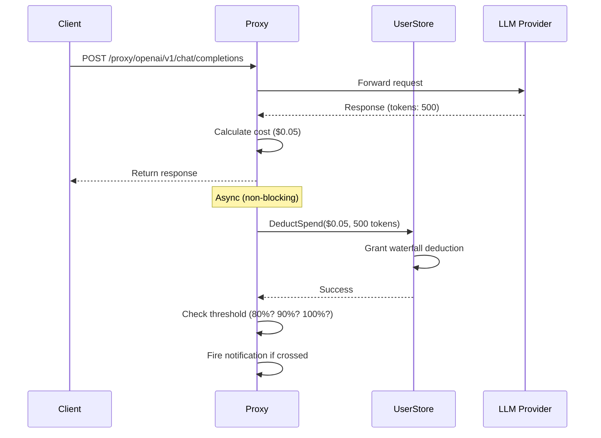

# 💸 Budget & Notification System

Candela provides per-user budget enforcement and threshold notifications to prevent runaway LLM spending.

## Budget Model

### Grant-First Waterfall

When an LLM call completes, cost is deducted using a **grant-first waterfall**:

```
1. Check active grants (earliest expiry first)
2. Deduct from grant balance
3. If grants exhausted → deduct from monthly budget
4. If monthly budget exceeded → reject future requests
```

```
┌──────────────┐
│ LLM Call      │  cost = $0.05
│ Completed     │
└──────┬───────┘
       ▼
┌──────────────┐    ┌──────────────┐
│ Grant A      │───▶│ Grant B      │  (earliest expiry first)
│ $2.00 remain │    │ $0.00 remain │
└──────┬───────┘    └──────────────┘
       │ deduct $0.05
       ▼
┌──────────────┐
│ Monthly       │  remaining = limit - spent
│ Budget        │
│ $50.00 limit  │
└──────────────┘
```

### Data Model

**Budget** (Firestore: `budgets/{userId}`):
```
limit_usd:     50.00      # Monthly spending cap
spent_usd:     12.34      # Current period accumulated spend
tokens_used:   45000      # Current period token count
period_type:   "monthly"  # "monthly", "weekly", "quarterly"
period_key:    "2026-04"  # Auto-reset when period changes
period_start:  2026-04-01
period_end:    2026-04-30
```

**Grant** (Firestore: `grants/{grantId}`):
```
user_id:    "user123"
amount_usd: 10.00
used_usd:   3.50
reason:     "Hackathon project budget"
granted_by: "admin@company.com"
starts_at:  2026-04-15
expires_at: 2026-04-30
```

### Budget Enforcement Flow



> [!NOTE]
> Budget enforcement is **post-deduction**, not pre-flight. The LLM call always goes through. Budget exhaustion is enforced via pre-flight checks on subsequent requests (via `CheckBudget()`).

---

## Threshold Notifications

### Default Thresholds

Notifications fire at **80%**, **90%**, and **100%** of the monthly budget:

| Threshold | Meaning | Example ($50 budget) |
|-----------|---------|---------------------|
| 80% | Warning — approaching limit | Spent ≥ $40.00 |
| 90% | Critical — almost exhausted | Spent ≥ $45.00 |
| 100% | Exceeded — over budget | Spent ≥ $50.00 |

### Deduplication

Each threshold fires **at most once per user per budget period**. The `BudgetChecker` tracks fired thresholds using a key format:

```
{userID}:{periodKey}:{threshold}
→ "user123:2026-04:0.80"
```

This prevents duplicate notifications when multiple calls cross the same threshold within a period.

### Notification Channels

Candela uses a pluggable `Notifier` interface:

```go
type Notifier interface {
    NotifyBudgetThreshold(ctx context.Context, alert BudgetAlert) error
}
```

#### Built-in: Log Notifier

The default `LogNotifier` emits structured log events that integrate with **Cloud Logging alert policies**:

```json
{
  "level": "WARN",
  "msg": "🔔 budget alert: 80% threshold reached",
  "user_id": "user123",
  "email": "dev@company.com",
  "threshold": "80%",
  "spent_usd": "42.50",
  "limit_usd": "50.00",
  "period": "2026-04"
}
```

#### Adding Slack Notifications

Implement the `Notifier` interface:

```go
type SlackNotifier struct {
    webhookURL string
    client     *http.Client
}

func (n *SlackNotifier) NotifyBudgetThreshold(ctx context.Context, alert storage.BudgetAlert) error {
    msg := fmt.Sprintf("🔔 %s has reached %d%% of their $%.2f budget ($%.2f spent)",
        alert.Email, int(alert.Threshold*100), alert.LimitUSD, alert.SpentUSD)

    payload, _ := json.Marshal(map[string]string{"text": msg})
    _, err := n.client.Post(n.webhookURL, "application/json", bytes.NewReader(payload))
    return err
}
```

Register in `cmd/candela-server/main.go`:

```go
checker := notify.NewBudgetChecker(
    &notify.LogNotifier{},
    &SlackNotifier{webhookURL: os.Getenv("SLACK_WEBHOOK_URL")},
)
llmProxy.SetBudgetChecker(checker)
```

#### Adding Microsoft Teams

Same pattern — implement `Notifier` with a Teams incoming webhook.

---

## Admin Operations

### Setting a Budget (Admin UI or API)

```bash
curl -X POST http://localhost:8181/candela.v1.UserService/SetBudget \
  -H "Content-Type: application/json" \
  -H "Authorization: Bearer <admin-token>" \
  -d '{
    "userId": "user123",
    "limitUsd": 100.00
  }'
```

### Creating a Grant

```bash
curl -X POST http://localhost:8181/candela.v1.UserService/CreateGrant \
  -H "Content-Type: application/json" \
  -H "Authorization: Bearer <admin-token>" \
  -d '{
    "userId": "user123",
    "amountUsd": 25.00,
    "reason": "Sprint 42 AI budget boost",
    "startsAt": "2026-04-20T00:00:00Z",
    "expiresAt": "2026-05-01T00:00:00Z"
  }'
```

### Emergency: Reset Spend

If a user's spend counter is incorrect:

```bash
curl -X POST http://localhost:8181/candela.v1.UserService/ResetSpend \
  -H "Content-Type: application/json" \
  -H "Authorization: Bearer <admin-token>" \
  -d '{"userId": "user123"}'
```

This zeroes the current-period spend counter. Use sparingly — it's logged in the audit trail.

---

## Cloud Logging Alert Policy

Create an alert when any user exceeds their budget:

```bash
gcloud alpha monitoring policies create \
  --display-name="Candela Budget Exceeded" \
  --condition-display-name="Budget 100% threshold" \
  --condition-filter='resource.type="cloud_run_revision"
    AND jsonPayload.msg=~"budget alert: 100%"' \
  --notification-channels=<CHANNEL_ID>
```

---

## Implementation Files

| File | Purpose |
|------|---------|
| `pkg/notify/notifier.go` | `BudgetChecker`, `LogNotifier`, threshold logic |
| `pkg/notify/notifier_test.go` | Unit tests for dedup and threshold evaluation |
| `pkg/storage/store.go` | `BudgetRecord`, `GrantRecord`, `BudgetCheckResult`, `Notifier` interface |
| `pkg/storage/firestoredb/firestoredb.go` | `DeductSpend()`, `CheckBudget()`, grant waterfall implementation |
| `pkg/proxy/proxy.go` | Budget deduction call in `buildSpan()` |
| `cmd/candela-server/main.go` | Wiring `BudgetChecker` into the proxy |
