# 🎬 Candela: 90-Second Getting Started Walkthrough

This document contains the official 90-second video walkthrough script, storyboard, voiceover narration, and visual sequence for **Candela**.



---

## ⏱️ Video Overview & Timeline

| Time | Scene | Topic | Visuals & Focus |
|:---|:---|:---|:---|
| **0:00 – 0:15** | **Scene 1** | **One-Line Install & Start** | macOS Homebrew install, single `candela start` command, daemon spins up with local UI & proxy URLs |
| **0:15 – 0:35** | **Scene 2** | **Zero-Code Proxy Mode** | Existing client script redirects `base_url` to `http://localhost:8181/proxy/openai/v1`; request completes normally |
| **0:35 – 0:55** | **Scene 3** | **Live Web Dashboard** | "Today" page reveals the radial budget ring gauge, spend velocity, hourly chart, and token metrics |
| **0:55 – 1:15** | **Scene 4** | **Waterfall Trace Inspection** | Deep trace inspection: waterfall span hierarchy (`agent.run` → `llm.chat`), token latency, and prompt caching cost reduction |
| **1:15 – 1:30** | **Scene 5** | **Team Governance & Peace of Mind** | Hard budget limits, per-user and per-SA caps, model allowlists, and production readiness |

---

## 🎙️ Scene-by-Scene Script & Storyboard

### Scene 1: Installation & Daemon Startup (0:00 – 0:15)

**On Screen:**
- Terminal window opens.
- User types:
  ```bash
  brew install candelahq/tap/candela
  candela start
  ```
- Terminal outputs:
  ```text
  🕯️ candela started (PID 4819)
     proxy: http://127.0.0.1:8181
     UI:    http://127.0.0.1:8181/_local/
     logs:  ~/.candela/candela.log
  ```

**Voiceover / Audio:**
> *"Managing LLM costs and latency shouldn't require complex SDK rewrites or clunky cloud setups. With Candela, getting production-grade observability takes seconds. Install with Homebrew or curl, run `candela start`, and your local proxy and web dashboard are live."*

---

### Scene 2: Zero-Code Proxy Mode (0:15 – 0:35)

**On Screen:**
- Split screen: code editor on the left, terminal on the right.
- Code editor highlights changing `base_url`:
  ```python
  from openai import OpenAI

  # Redirect to local Candela proxy
  client = OpenAI(base_url="http://127.0.0.1:8181/proxy/openai/v1")

  response = client.chat.completions.create(
      model="gpt-4o",
      messages=[{"role": "user", "content": "Summarize latency report"}],
  )
  ```
- Script runs and prints the output seamlessly without any SDK modifications.

**Voiceover / Audio:**
> *"To start tracking, simply point your existing client's base URL to Candela. Works with OpenAI, Google Gemini, Anthropic via Vertex AI, AWS Bedrock, and local models. No proprietary SDKs. Zero code refactoring."*

---

### Scene 3: Live Web Dashboard & Budget Ring (0:35 – 0:55)

**On Screen:**
- Browser transitions to `http://127.0.0.1:8181/_local/`.
- The **Today** view highlights:
  - **Budget Ring Gauge**: Smooth radial SVG dial showing `74% used` (`$14.80 / $20.00`).
  - **Live Velocity**: Burn rate calculated at `~$1.85/hr`.
  - **Metrics**: 1,428 requests, 842.6k tokens processed, 68.4% prompt cache hit rate.
  - **Hourly Spend Bar Chart**: Hourly breakdown of spend by model.

**Voiceover / Audio:**
> *"Instantly open your local dashboard. Our signature budget ring gives you real-time visibility into today's spend, projected exhaustion, and hourly velocity before your cloud bill arrives."*

---

### Scene 4: Deep Trace Inspection & Waterfall Spans (0:55 – 1:15)

**On Screen:**
- Click into the **Traces** tab and select the latest trace.
- Waterfall Gantt chart renders spans:
  - Root span: `agent.execute_plan` (1,240ms)
  - Sub-span: `vector.similarity_search` (180ms)
  - LLM call: `anthropic.messages.create` (920ms)
  - Sub-span: `prompt_caching.read` badge showing **Saved 90% Cost**.
- Exact token counts, per-span micro-cent cost, and full OpenTelemetry attributes displayed in the side sheet.

**Voiceover / Audio:**
> *"Need to inspect multi-step agent flows? Dive into full waterfall traces. Candela tracks nested LLM calls, RAG retrievals, prompt cache savings, and token latency with 100% OpenTelemetry semantic conventions."*

---

### Scene 5: Team Governance & Production Readiness (1:15 – 1:30)

**On Screen:**
- Quick overview of **Admin Budgets**, **Leaderboard**, and Cloud Deployment:
  - Per-user daily budget caps ($10/day).
  - Service account budget enforcement.
  - Multi-cloud enterprise backends: BigQuery, DuckDB, Cloud Run, Kubernetes sidecars.
- Call to action with the Candela flame emblem:
  ```text
  🕯️ Candela — Open-source LLM Observability
  GitHub: github.com/candelahq/candela
  Web:    candelahq.com
  ```

**Voiceover / Audio:**
> *"Enforce hard budget limits per team or service account to prevent runaway bills. When you're ready for production, deploy Candela as a sidecar or managed server on GCP and AWS. Get started for free today on GitHub."*

---

## 💻 Reproduce the 90-Second Demo Locally

Run these steps in your terminal to see everything in action:

```bash
# 1. Install & start Candela
candela start

# 2. Make an LLM call through the proxy
curl -X POST http://127.0.0.1:8181/proxy/openai/v1/chat/completions \
  -H "Content-Type: application/json" \
  -H "Authorization: Bearer $OPENAI_API_KEY" \
  -d '{
    "model": "gpt-4o",
    "messages": [{"role": "user", "content": "Explain quantum computing in one sentence"}]
  }'

# 3. View the live dashboard in your browser
# URL: http://127.0.0.1:8181/_local/
# macOS: open http://127.0.0.1:8181/_local/
# Linux: xdg-open http://127.0.0.1:8181/_local/
# Windows: start http://127.0.0.1:8181/_local/
open http://127.0.0.1:8181/_local/ 2>/dev/null || xdg-open http://127.0.0.1:8181/_local/ 2>/dev/null || echo "Open http://127.0.0.1:8181/_local/ in your browser"
```
