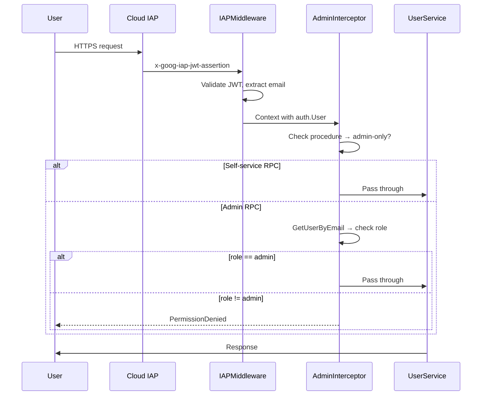

# User Management & Access Control

Candela provides multi-user support with role-based access control, budget enforcement, and audit logging.

## Roles

| Role | Enum Value | Capabilities |
|------|-----------|--------------|
| **Developer** | `USER_ROLE_DEVELOPER = 1` | Use proxy, view own traces/costs, self-service endpoints |
| **Admin** | `USER_ROLE_ADMIN = 2` | Manage users, set budgets, create grants, view all data, audit log |

## Authentication Flow



### Dev Mode
When `DEV_MODE=true`, the `IAPMiddleware` skips JWT validation and injects a synthetic admin user (`admin@localhost`).

## Self-Service vs Admin RPCs

### Self-Service (any authenticated user)
- `GetCurrentUser` — returns own profile, budget, and active grants
- `GetMyBudget` — returns own budget and spending

### Admin-Only (13 RPCs)
- `CreateUser`, `ListUsers`, `GetUser`, `UpdateUser`
- `DeactivateUser`, `ReactivateUser`
- `SetBudget`, `GetBudget`, `ResetSpend`
- `CreateGrant`, `ListGrants`, `RevokeGrant`
- `ListAuditLog`

## Budget Enforcement

Candela uses a **grant-first waterfall** model for spending:

```
1. Check active grants (earliest expiry first)
2. Deduct from grant balance
3. If grants exhausted → check monthly budget
4. If monthly budget exceeded → reject request
```

### Budget Structure
```protobuf
message UserBudget {
  double limit_usd = 1;      // Monthly spending cap
  double spent_usd = 2;      // Current period spending
  BudgetPeriodType period_type = 3;  // monthly (reset automatically)
}
```

### Grants
Grants are one-time spending allowances that bypass the monthly budget:
```protobuf
message BudgetGrant {
  string id = 1;
  double amount_usd = 2;
  double used_usd = 3;
  string reason = 4;
  google.protobuf.Timestamp starts_at = 7;
  google.protobuf.Timestamp expires_at = 8;
}
```

## Input Validation

All UserService requests are validated server-side using [`protovalidate`](https://github.com/bufbuild/protovalidate):

| Field | Rule | Example |
|-------|------|---------|
| `email` | Valid email format | `user@company.com` |
| `monthly_budget_usd` | `>= 0` | Non-negative dollar amount |
| `limit_usd` (SetBudget) | `> 0` | Must be positive |
| `amount_usd` (CreateGrant) | `> 0` | Must be positive |
| `user_id` / `id` | `min_len: 1` | Required, non-empty |
| `limit` (ListAuditLog) | `0 ≤ x ≤ 500` | Pagination cap |
| `expires_at` vs `starts_at` | CEL: `expires > starts` | Date ordering |

The same validation rules run **client-side** in the admin UI via `@bufbuild/protovalidate` JavaScript.

## Data Model (Firestore)

```
firestore/
├── users/{userId}
│   ├── email: string
│   ├── display_name: string
│   ├── role: "admin" | "developer"
│   ├── status: "provisioned" | "active" | "inactive"
│   ├── last_seen_at: timestamp
│   └── created_at: timestamp
├── budgets/{userId}
│   ├── limit_usd: number
│   ├── spent_usd: number
│   ├── period_type: "monthly"
│   └── period_start: timestamp
├── grants/{grantId}
│   ├── user_id: string
│   ├── amount_usd: number
│   ├── used_usd: number
│   ├── reason: string
│   ├── starts_at: timestamp
│   └── expires_at: timestamp
└── audit_log/{entryId}
    ├── actor_id: string
    ├── action: string
    ├── target_id: string
    ├── details: map
    └── created_at: timestamp
```

## Admin UI

The admin panel lives at `/admin/*` routes and is guarded by the `AdminLayout`:

| Route | Purpose |
|-------|---------|
| `/admin/users` | User CRUD, status management, role assignment |
| `/admin/budgets` | Budget enforcement explainer, waterfall visualization |
| `/admin/audit` | Audit log timeline with filterable action types |

Non-admin users see an "Access Denied" page when navigating to any admin route.

## Auto-Provisioning

Users are **auto-provisioned** on first login:
1. IAP authenticates the user via Google Identity
2. `GetCurrentUser` checks if the user exists in Firestore
3. If not found, creates a new user with `status: provisioned`, `role: developer`
4. On subsequent requests, `status` is upgraded to `active`

Admins can also **pre-provision** users via `CreateUser` to assign roles and budgets before first login.
