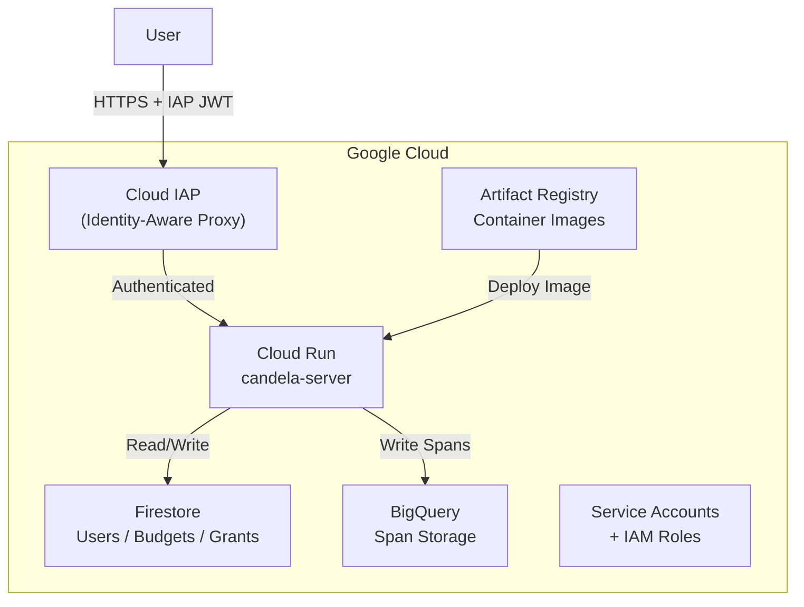

# Candela — Terraform Infrastructure

This directory contains the **OpenTofu/Terraform** configuration for deploying Candela on **Google Cloud Platform**.

## Architecture



## Resources

| File | Resources |
|------|-----------|
| `main.tf` | Provider config, GCP project, enabled APIs |
| `cloud_run.tf` | Cloud Run service, IAP backend, domain mapping |
| `bigquery.tf` | BigQuery dataset + spans table (auto-generated schema) |
| `firestore.tf` | Firestore database + collections (users, budgets, grants, audit_log) |
| `iam.tf` | Service accounts, Cloud Run invoker, BigQuery roles |
| `artifact_registry.tf` | Container image registry |
| `variables.tf` | Input variables (project_id, region, domain, etc.) |
| `outputs.tf` | Output values (service URL, dataset, etc.) |

## Prerequisites

- [OpenTofu](https://opentofu.org/) or [Terraform](https://www.terraform.io/) ≥ 1.5
- GCP project with billing enabled
- `gcloud` CLI authenticated (`gcloud auth application-default login`)

## Usage

### 1. Configure Variables

```bash
cp terraform.tfvars.example terraform.tfvars
# Edit terraform.tfvars with your project details
```

### 2. Initialize & Plan

```bash
tofu init    # or: terraform init
tofu plan    # or: terraform plan
```

### 3. Apply

```bash
tofu apply   # or: terraform apply
```

### 4. Get Outputs

```bash
tofu output  # Shows service URL, BigQuery dataset, etc.
```

## Key Design Decisions

### IAP Authentication
All requests to Cloud Run pass through **Identity-Aware Proxy**. The Candela server validates the `x-goog-iap-jwt-assertion` header and extracts the user identity. In dev mode, a synthetic admin user is injected instead.

### Firestore for User Data
Users, budgets, grants, and audit logs are stored in Firestore (Native mode). This provides:
- Real-time document updates
- Built-in TTL for grant expiration
- Strongly consistent reads for budget enforcement

### BigQuery for Spans
LLM trace spans are written to BigQuery using a proto-generated schema (`protoc-gen-bq-schema`). This enables:
- Serverless analytics at scale
- Standard SQL for cost analysis
- Integration with Looker / Data Studio

### Role-Based Access Control
Two roles defined in proto: `DEVELOPER` (can use proxy, view own data) and `ADMIN` (can manage users, budgets, view all data). The `AdminInterceptor` enforces this at the ConnectRPC layer.

## Variables Reference

| Variable | Description | Default |
|----------|-------------|---------|
| `project_id` | GCP project ID | (required) |
| `region` | GCP region | `us-central1` |
| `environment` | Deployment environment | `production` |
| `domain` | Custom domain for Cloud Run | `""` |
| `iap_oauth_client_id` | OAuth client ID for IAP | (required for prod) |
| `iap_oauth_client_secret` | OAuth client secret for IAP | (required for prod) |

> [!NOTE]
> See `terraform.tfvars.example` for a full list of configurable variables.

## State Management

For production deployments, configure remote state:

```hcl
terraform {
  backend "gcs" {
    bucket = "your-project-tfstate"
    prefix = "candela"
  }
}
```
